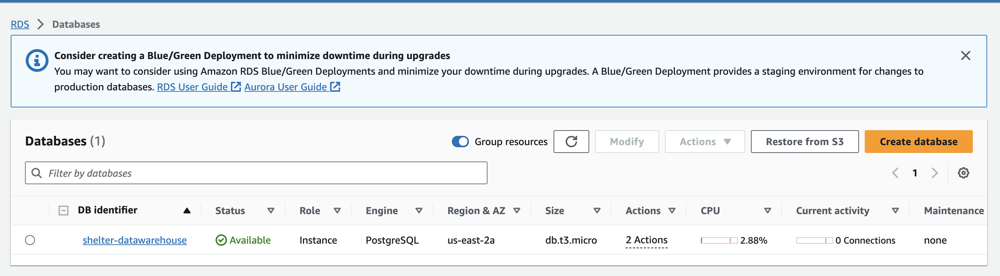

# Data Center Scale Computing

### CSCI-5253 - Fall 23 Dr. Alex Yarosh

---

### About 

This repository holds all the future and current homework assignment files as pull requests individualised as different branches.

---

### Lab03 Airflow -- Instructions to Run

##### Docker Compose Instantiation

* Instantiate Docker

Navigate inside the folder ( Make sure the `docker-compose.yml` is within the directory check with `ls` )

In the **terminal/wsl**, run the following

```bash
docker compose up
```

---

#### Cloud Instantiation References - Proof of Execution 

### Airflow Dag Represenation


## DAGs


## Storing Data on to the Cloud - S3 Bucket


## Cloud Relational Database - Amazon RDS



## Connection Test to the Cloud RDS through DBeaver


## Succesful Data Loading through the ETL process


##### Note ~ Edit Credentials 

In order to execute the lab-3 code, nagivate to `/dags/secrets.env` replace the credentials items with your own before running the `docker-compose.yml`.
And, in order establish the relationships between the tables please run the `init.sql` file. 

----

